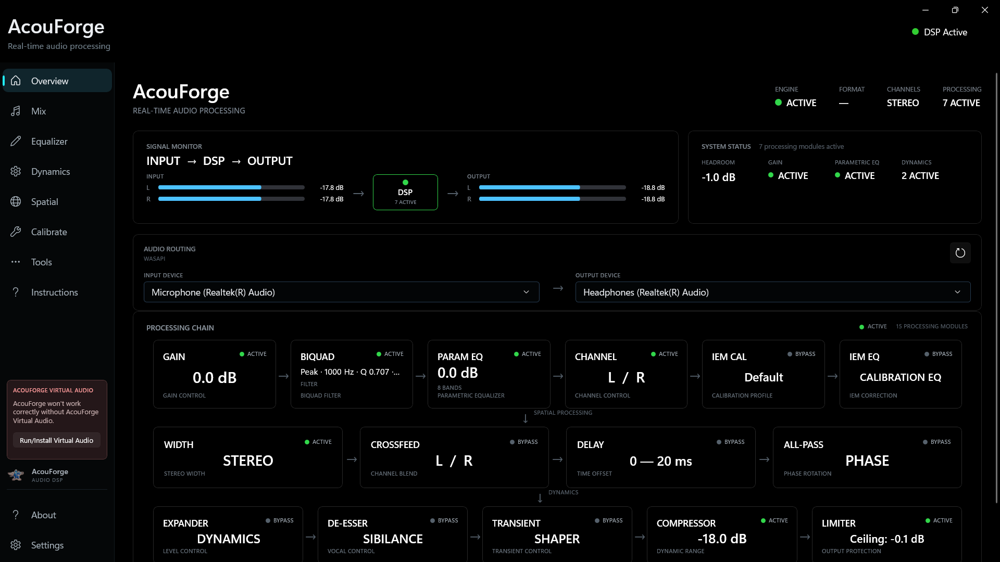
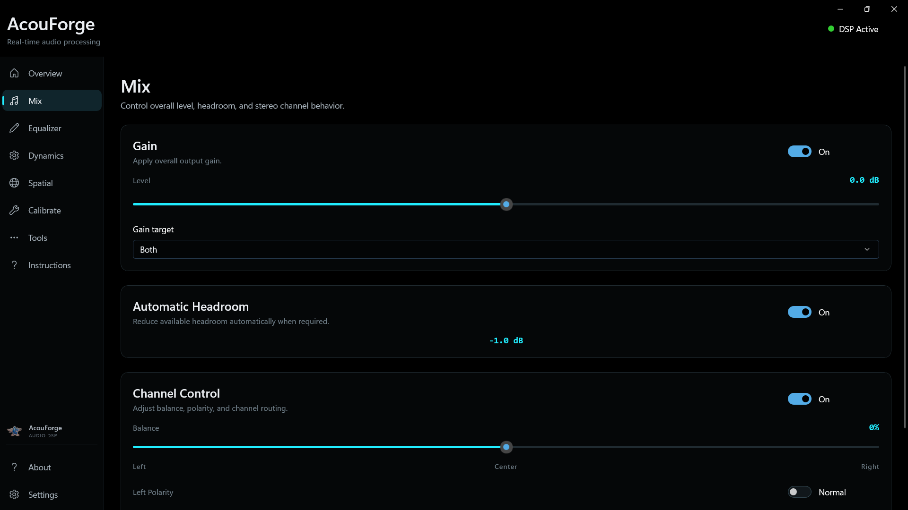
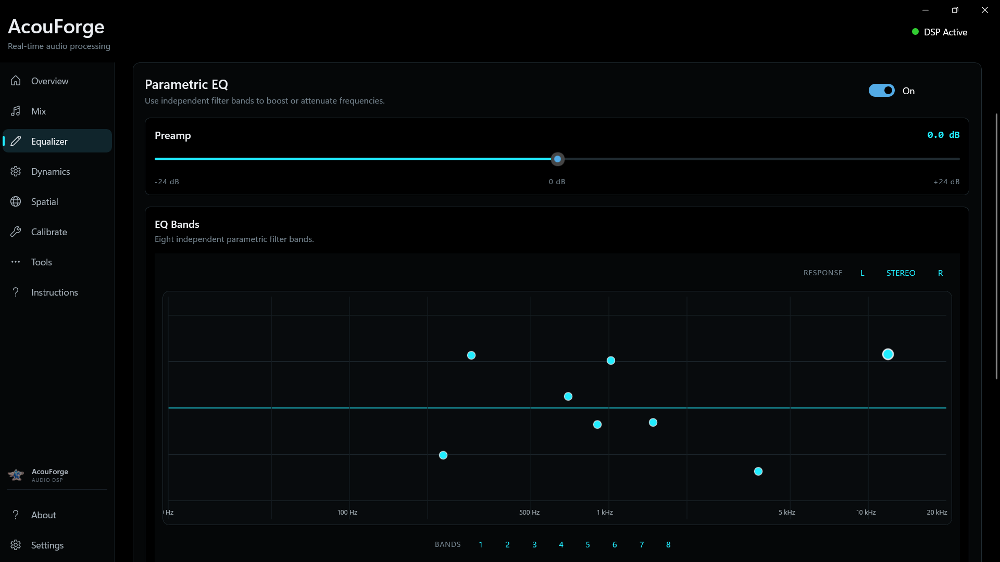
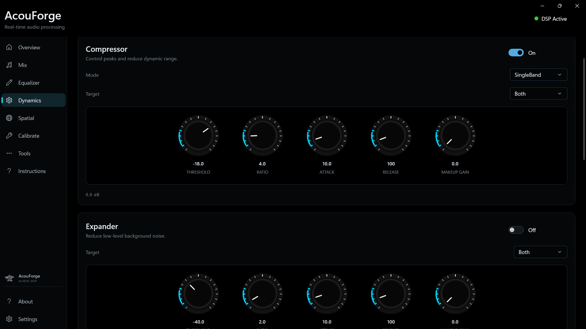
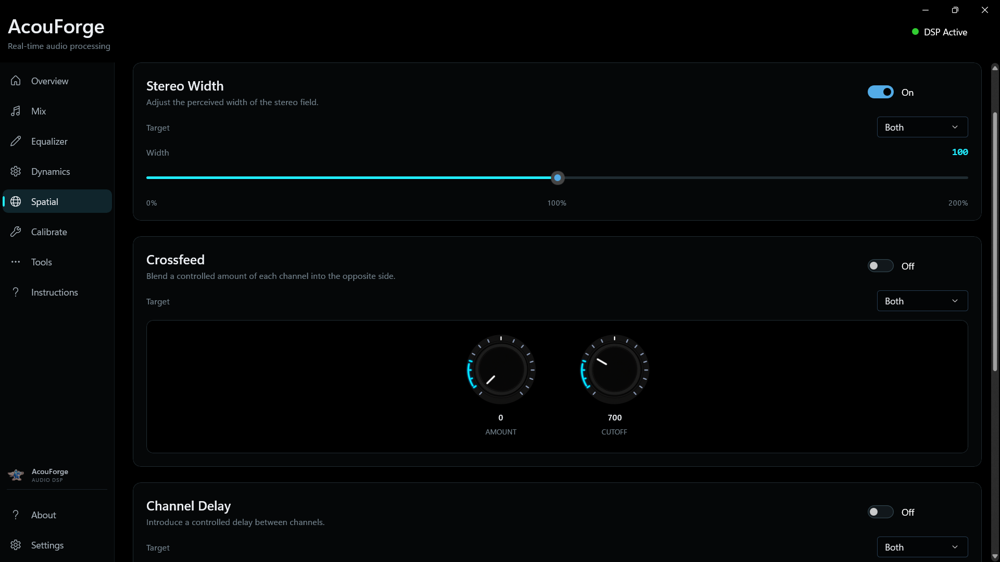
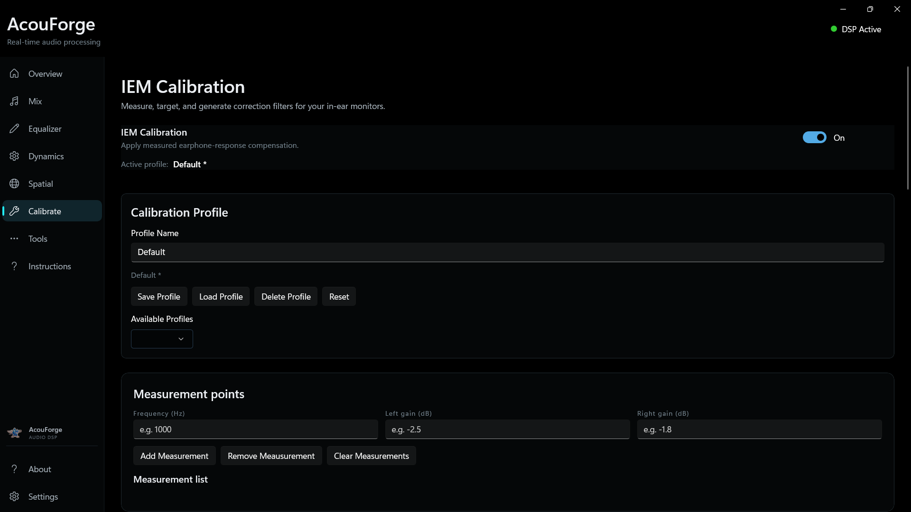
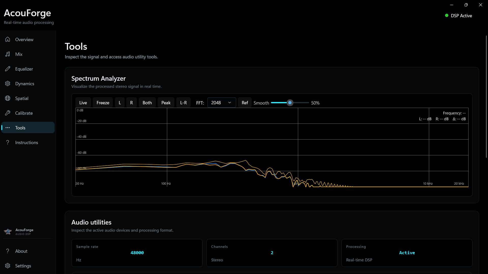
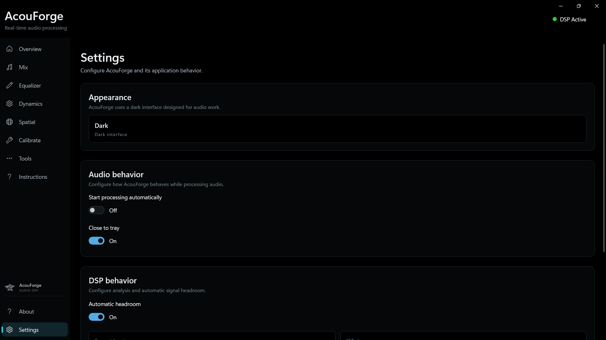
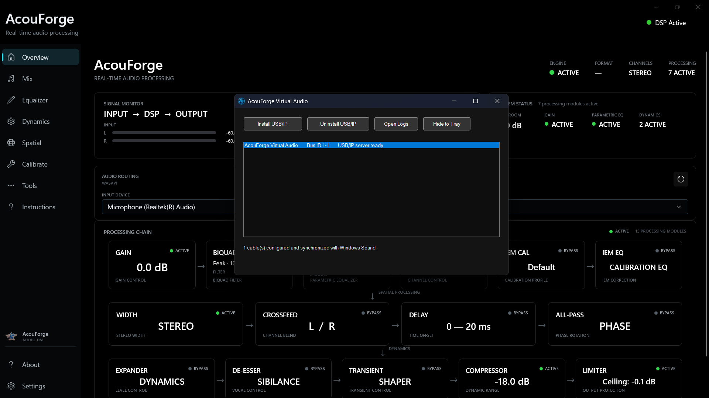

<div align="center">


# AcouForge

### Precision Audio Processing for Windows

Real-time equalization, dynamics, spatial processing, calibration, channel wise DSP effects
and audio tools — built into one processing environment.

<br>

<a href="https://github.com/Hajime-GG/AcouForge/releases/latest">
  <strong>⬇ Download AcouForge</strong>
</a>

<br><br>

</div>

---

## ✨ The Audio Processing Layer Between Your Apps and Your Ears ✨

**AcouForge** is a real-time Windows audio processing suite designed to give
you precise control over the sound reaching your listening device.

Instead of relying on multiple independent applications, AcouForge brings
the processing chain together in one environment.

**Equalization. Dynamics. Spatial processing. Calibration. Audio tools.**

All working together in real time.

---

## ✦ What AcouForge Does

<table>
<tr>
<td width="50%" valign="top">

### 🎚 Equalizer

Shape your sound with real-time equalization and detailed control over your
audio response.

</td>
<td width="50%" valign="top">

### 📈 Dynamics

Control the dynamics of your audio with real-time processing designed for
flexible playback control.

</td>
</tr>

<tr>
<td width="50%" valign="top">

### ◉ Spatial Audio

Explore spatial processing designed to provide greater control over the
presentation and character of your audio.

</td>
<td width="50%" valign="top">

### 🎧 Calibration

Work with measurement data and calibration profiles to create a more
accurate processing setup.

</td>
</tr>

<tr>
<td width="50%" valign="top">

### 🔊 Virtual Audio

Route Windows playback through AcouForge using the
**AcouForge Virtual Audio** device.

</td>
<td width="50%" valign="top">

### 🛠 Audio Tools

Additional tools for configuring, measuring, and working with your audio
system.

</td>
</tr>
</table>

---

## ☄️ Signal Flow

AcouForge is designed to sit between your Windows applications and your
physical listening device.

```text
┌─────────────────────────┐
│   Windows Applications  │
└────────────┬────────────┘
             │
             ▼
┌─────────────────────────┐
│  AcouForge Virtual      │
│         Audio           │
└────────────┬────────────┘
             │
             ▼
┌─────────────────────────┐
│        AcouForge        │
│                         │
│  EQ • Dynamics          │
│  Spatial • Calibration  │
│  Audio Tools            │
└────────────┬────────────┘
             │
             ▼
┌─────────────────────────┐
│   Physical Audio Device │
│                         │
│ Headphones • Speakers   │
│          • DAC          │
└─────────────────────────┘
```

---

## ✨ Screenshots

### Overview



### Mix



### Equalizer



### Dynamics



### Spatial Audio



### Calibration



### Tools



### Settings



### Virtual Audio



---

## 🔊 AcouForge Virtual Audio

AcouForge includes a dedicated virtual audio device that provides the
Windows playback entry point for the processing pipeline.

The recommended configuration is:

```text
Windows Apps
     │
     ▼
AcouForge Virtual Audio
     │
     ▼
AcouForge
     │
     ▼
Headphones / Speakers / DAC
```

### Basic setup

1. Install AcouForge from the latest release.
2. Install or start **AcouForge Virtual Audio** when prompted.
3. Set **AcouForge Virtual Audio** as the Windows playback device.
4. Open AcouForge.
5. Select your physical headphones, speakers, or DAC as the output device.
6. Start playback and configure your processing modules.

For detailed setup and troubleshooting, see:

- [`docs/getting-started.md`](docs/getting-started.md)
- [`docs/installation.md`](docs/installation.md)
- [`docs/virtual-audio.md`](docs/virtual-audio.md)
- [`docs/troubleshooting.md`](docs/troubleshooting.md)

> **Note:** AcouForge users do not need to manually configure the underlying
> virtual-audio implementation. The AcouForge distribution provides the
> components required by the supported setup.

---

## 🛍 Microsoft Store

### Coming Soon

AcouForge is also planned for distribution through the **Microsoft Store**.

---

## 📦 Installation

Download the latest installer from:

**[GitHub Releases](https://github.com/Hajime-GG/AcouForge/releases/latest)**

AcouForge is distributed as a Windows desktop application.

For the complete installation procedure, see
[`docs/installation.md`](docs/installation.md).

---

## 🖥 System Requirements

- Windows 10/11 64-bit
- A compatible Windows audio playback device
- Administrator permission when installing required system components

For the most reliable experience, keep Windows audio drivers and your
playback device drivers up to date.

---

## 🧭 Documentation

| Guide | Description |
| --- | --- |
| [Getting Started](docs/getting-started.md) | Configure AcouForge for the first time |
| [Installation](docs/installation.md) | Installation, updates, and configuration |
| [Virtual Audio](docs/virtual-audio.md) | Configure AcouForge Virtual Audio |
| [Troubleshooting](docs/troubleshooting.md) | Common audio and installation problems |

---

## 🏗 Architecture

AcouForge separates the user interface from the real-time audio processing
engine.

```text
┌─────────────────────────────────────────────┐
│                 AcouForge UI                │
│                                             │
│  Equalizer • Dynamics • Spatial • Tools     │
│  Calibration • Settings                     │
└──────────────────────┬──────────────────────┘
                       │
                       │ IPC
                       ▼
┌─────────────────────────────────────────────┐
│             AcouForge Audio Engine          │
│                                             │
│       Real-time audio processing            │
└──────────────────────┬──────────────────────┘
                       │
                       ▼
              Physical Audio Device
```

This separation allows the user interface and audio-processing engine to
operate as distinct parts of the application.

---

## 🔐 Privacy

AcouForge stores application configuration and user settings locally on
your Windows system.

See [`PRIVACY.md`](PRIVACY.md) for the privacy policy.

---

## 📜 Licensing

AcouForge is proprietary software.

The AcouForge source code, application, DSP implementation, branding,
artwork, and other proprietary components are **not open source** and may
not be redistributed except as expressly permitted by the applicable
license terms.

See:

- [`LICENSE.md`](LICENSE.md) — AcouForge Software License
- [`EULA.md`](EULA.md) — End User License Agreement
- [`THIRD-PARTY-NOTICES.md`](THIRD-PARTY-NOTICES.md) — third-party notices
- [`CREDITS.md`](CREDITS.md) — project attribution and acknowledgements

Applicable upstream license texts are preserved under [`licenses/`](licenses/).

---

## 🙏 Credits

AcouForge acknowledges the open-source projects and contributors whose work
helped make parts of the AcouForge Virtual Audio architecture possible.

See [`CREDITS.md`](CREDITS.md) for attribution details.

---
